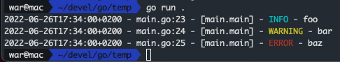
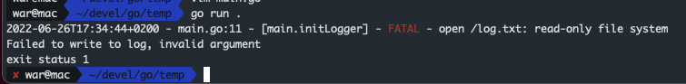

# logger_iso8601

Custom Go log formatter making use of [logrus](https://github.com/sirupsen/logrus).

## Usage

```go
package main

import (
	"github.com/williamvannuffelen/go_logger_iso8601"
	log "github.com/sirupsen/logrus"
)

func initLogger(filePath string) (*log.Logger, error) {
	log, err := logger_iso8601.InitLogger(filePath)
	if err != nil {
		log.Fatal(err)
	}
	return log, err
}

func main() {
  // init logger
  log, err := initLogger("log.txt")
  if err != nil {
		log.Fatal(err)
  }

  log.Info("foo")
  log.Warn("bar")
  log.Error("baz")
}
```

Resulting output looks like:



Error initializing the logger:



